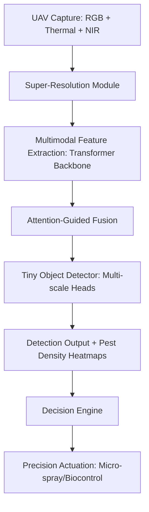

# UAV-Assisted Agricultural Pest Surveillance

_A Comprehensive Literature and Patent Review with Novelty Assessment_

---

## 1. Introduction

The increasing demand for precision agriculture has accelerated the adoption of **Unmanned Aerial Vehicles (UAVs)** for pest and insect monitoring in farmland. Traditional ground-based inspection methods are labor-intensive, time-consuming, and prone to delayed detection, which often results in significant yield losses. UAV-based pest detection offers high-frequency, large-area monitoring with minimal labor, enabling timely intervention through **Integrated Pest Management (IPM)** frameworks.

However, challenges remain — particularly in **small-object detection**, **multimodal data fusion**, and **onboard model deployment** under computational constraints. This document surveys existing research papers and patents, identifies gaps, and proposes unique technical contributions with potential for **patentability**.

---

## 2. Literature Survey

### **2.1 Key Papers**

---

#### **1. A Lightweight Pest Detection Model for Drones Based on Transformer and Super-Resolution Sampling Techniques**

**Bai et al., Agriculture, 2023** — [MDPI Link](https://www.mdpi.com/)

- **What they did:**  
  Developed a **lightweight pest detection model** optimized for UAV imagery.  
  Combined **transformer-based backbone** with **super-resolution sampling** to detect very small pests from low-resolution drone images.
- **Tech / Methods:**
  - Transformer-based feature extractor
  - Super-resolution upsampling for better small-object clarity
  - Low-compute optimization for embedded systems
- **Results:** Improved **mAP** for small-object categories, showing strong UAV deployment potential.

---

#### **2. Advanced Insect Detection Network (AIDN) for UAV-Based Biodiversity Monitoring**

**MDPI Remote Sensing, 2024** — [MDPI Link](https://www.mdpi.com/)

- **What they did:**  
  Proposed **AIDN**, focusing on insect detection/classification from aerial UAV imagery.  
  Introduced evaluation metrics specialized for **tiny object detection**.
- **Tech / Methods:**
  - Preprocessing for tiny object retention
  - Multi-scale feature aggregation
  - Class imbalance mitigation
  - IoU optimization for small targets
- **Results:** Significant gains in **mAP50** for aerial insect datasets.

---

#### **3. Remote Sensing Technologies Using UAVs for Pest and Disease Detection**

**MDPI Remote Sensing (Review)** — [MDPI Link](https://www.mdpi.com/)

- **What it covers:**  
  Comprehensive review of **RGB, multispectral, hyperspectral, and thermal sensors** for UAV-based pest/disease detection.
- **Key Insights:**
  - Thermal detects canopy stress or hidden infestations.
  - Multispectral/hyperspectral capture biochemical stress before visible symptoms.
- **Relevance:** Supports **multimodal fusion** as a superior approach to RGB-only detection.

---

#### **4. Drones in Insect Pest Management**

**Frontiers in Agronomy Review, 2021** — [Frontiers Link](https://www.frontiersin.org/)

- **What it covers:**  
  Broad survey of UAV pest management applications from **monitoring to intervention**.
- **Highlights:**
  - Constraints: altitude, resolution, payload.
  - Timely detection's role in IPM.
- **Relevance:** Provides **operational guidelines** for UAV-based pest surveillance.

---

#### **5. A Framework for Agricultural Pest and Disease Monitoring Based on UAVs**

**PMC Open Access Review** — [PMC Link](https://www.ncbi.nlm.nih.gov/pmc/)

- **What it covers:**  
  End-to-end UAV framework for mapping, sensing, image analysis, and decision support.
- **Relevance:** Provides **system architecture reference** for pipeline integration.

---

## 3. Patent Survey

---

### **A. US 2017/0231213 A1 — Pest Abatement Utilizing an Aerial Drone**

- **Claims:** UAV with pest/environmental sensors + abatement mechanism (localized spraying, biocontrol release).
- **Focus:** Sensor-triggered action, not computer vision algorithms.
- **Link:** [Google Patents](https://patents.google.com/patent/US20170231213A1)

---

### **B. US 2017/0089761 A1 — Spectral Imaging System for Remote and Noninvasive Detection**

- **Claims:** Spectral imaging hardware + algorithms for substance detection using filter arrays.
- **Relevance:** Relevant for multispectral/hyperspectral UAV sensing.
- **Link:** [Google Patents](https://patents.google.com/patent/US20170089761A1)

---

### **C. US 2022/0211026 A1 — System and Method for Field Treatment and Monitoring**

- **Claims:** UAV-based treatment logistics — pesticide dispensing + monitoring workflow.
- **Relevance:** Connects detection to treatment actions.
- **Link:** [Google Patents](https://patents.google.com/patent/US20220211026A1)

---

### **D. US 10,364,029 B2 — Drone for Agriculture (Spraying Platform)**

- **Claims:** Hardware claims for spraying drones, precise application mechanisms.
- **Relevance:** Platform-level prior art for UAV spraying.
- **Link:** [Google Patents](https://patents.google.com/patent/US10364029B2)

---

### **E. Patent Landscape Review — Triangle IP**

- **Findings:**  
  Most patents focus on **hardware, dispensing, logistics**.  
  **Gap:** Few patents claim **deep learning detection pipelines** for aerial insects.
- **Link:** [Triangle IP](https://triangleip.com)

---

## 4. Technical Takeaways

- **Multimodal Sensing:** RGB + Thermal/Multispectral boosts robustness, especially under canopy.
- **Tiny Object Detection:** Main technical challenge for UAV pest surveillance — addressed via transformers, multi-scale fusion, super-resolution.
- **Edge Constraints:** Lightweight models required for on-board deployment.
- **Patent Gap:** Algorithmic/multimodal detection pipelines under-explored in patents.

---

## 5. Novelty & Patentable Opportunities

1. **Attention-Guided Multimodal Fusion Pipeline**

   - Combines RGB + Thermal + NIR using **multi-scale attention fusion**.
   - Novel for pest detection, especially tiny objects.

2. **Joint Super-Resolution + Detection Co-Training**

   - Trains SR and detection networks together for pest-specific aerial footage.

3. **Active Learning for Few-Shot Field Adaptation**

   - On-the-fly fine-tuning from operator annotations in the field.

4. **Dataset + Annotation Protocol IP**

   - Multimodal, geo-referenced, species-specific UAV pest dataset.

5. **Detection-Driven Precision Actuation**
   - Confidence-weighted detection linked to wind, crop stage, and geo-mapping for micro-spraying.

---

## 6. Example Architecture Diagram

---

## 6. Conclusion

While UAV-based pest detection is a growing research and patent field, there is clear novelty space in multimodal attention fusion, joint SR-detection training, and field-adaptive active learning. Coupling these with a unique dataset and decision logic yields a patentable, high-impact solution.
